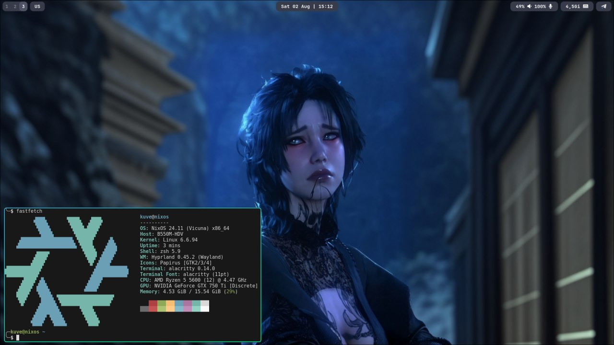

# ❄️ kuve env

Wallpapers and configs for my system




# ⭐️ features

- **waybar**
- **mako**
- **Hyprland**
- **wallpapers**
- **nixos**

# 📦 content

This repository contains files such as:

- **wallpapers** - wallpapers for pc and phone
- **nix** - all configurations for nixos
  - **nix-os** - system configuration
    - **mydwm** - my dwm build
    - **slstatus** - my slstatus build
  - **home-manager** - home-manager configurations
    - **modules** - separate configuration for packages
- **scripts** - my scripts

# 📀 installation

Installing the version with hyprland

1. **Install [NixOS](https://nixos.org/)**

2. **Clone the repository**

```bash
git clone https://github.com/Hindbeer/configs
cd configs/nix/
```

3. **Put your `hardware-configuration.nix` file there**

```bash
cp /etc/nixos/hardware-configuration.nix ./
```

4. **Edit the `flake.nix`, `./nix/configuration.nix`, `./home-manager/home.nix` file if needed**

example `flake.nix`

```diff
{
    description = "system configuration";

    inputs = {
        nixpkgs.url = "github:nixos/nixpkgs/nixos-24.11";

        home-manager = {
--            url = "github:nix-community/home-manager/release-24.11";
++            url = "<your_home_manager_version>";

            inputs.nixpkgs.follows = "nixpkgs";
        };
    };

    outputs = { nixpkgs, home-manager, ... }:
    let
        system = "x86_64-linux";
    in {
        nixosConfigurations.nixos = nixpkgs.lib.nixosSystem {
            inherit system;
            modules = [ ./nixos/configuration.nix ];
        };

--        homeConfigurations.kuve = home-manager.lib.homeManagerConfiguration {
++        homeConfigurations.<your hostname> = home-manager.lib.homeManagerConfiguration {

            pkgs = nixpkgs.legacyPackages.${system};
            modules = [ ./home-manager/home.nix ];
        };
    };
}
```

5. **Rebuilding**

```bash
git add .
nixos-rebuild switch --flake ./#<hostname>
home-manager switch --flake ./#<hostname>
```

> [!NOTE]
> All this may change over time. If you have any recommendations, you can contact me at the link below.

# 📁 DWM version

Edit configs for dwm build


1. **Edit `./home-manager/modules/bundle.nix`**

```diff
{
  imports = [
--    ./hyprland/bundle.nix
++  # ./hyprland/bundle.nix
    ./cursor.nix
    ./qt.nix
    ./gtk.nix
  ];
}
```

2. **Edit `./nixos/configuration.nix`**

```diff
...
--  # services.xserver.videoDrivers = ["nvidia"];
++   services.xserver.videoDrivers = ["nvidia"];
...
```

```diff
...
  # DWM
--  # services.xserver = {
--  #   enable = true;
--  #   windowManager.dwm.enable = true;
--  #   windowManager.dwm.package = pkgs.dwm.overrideAttrs {
--  #     src = ./mydwm/dwm;
--  #   };
--  # };

++ services.xserver = {
++   enable = true;
++   windowManager.dwm.enable = true;
++   windowManager.dwm.package = pkgs.dwm.overrideAttrs {
++     src = ./mydwm/dwm;
++   };
++ };


  # hyprland
--  programs.hyprland = {
--    enable = true;
--    xwayland.enable = true;
--  };

--  programs.hyprlock.enable = true;
--  security.pam.services.hyprlock = {};

++  # programs.hyprland = {
++  #   enable = true;
++  #   xwayland.enable = true;
++  # };

++  # programs.hyprlock.enable = true;
++  # security.pam.services.hyprlock = {};
...
```

```diff
...
 environment.systemPackages = with pkgs; [
...
--    # xorg.xinit
--    # xorg.xorgserver
++     xorg.xinit
++     xorg.xorgserver
  ];
...
```

3. **Rebuilding**

```bash
git add .
nixos-rebuild switch --flake ./#<hostname>
home-manager switch --flake ./#<hostname>
```

# 👥 contacts

If you have any questions or suggestions, you can contact me at Telegram: [@G0golMogol](https://t.me/G0golMogol) || Discord: Cazzate
