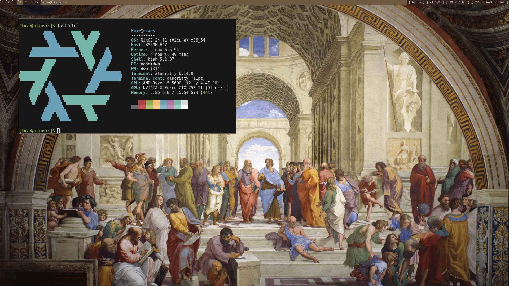

# ❄️ kuve env

Wallpapers and configs for my system

# ⭐️ Features

- **dwn**
- **slstatus**
- **wallpapers**
- **nixos**

# 📦 content

This repository contains files such as:

- **wallpapers** - wallpapers for pc and phone
- **nix** - all configurations for nixos
  - **nix-os** - system configuration
    - **mydwm** - my dwm build
    - **slstatus** - my slstatus build
  - **home-manager** - home-manager configurations
    - **modules** - separate configuration for packages
- **scripts** - my scripts

[!TIP]
All this may change over time. If you have any recommendations, you can contact me at the link below.

# 👥 contacts

If you have any questions or suggestions, you can contact me at Telegram: [@G0golMogol](https://t.me/G0golMogol)
